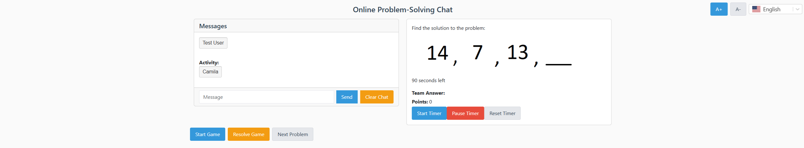
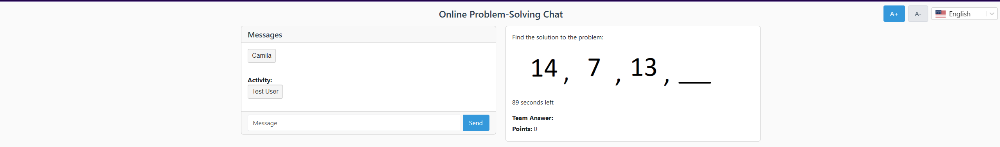
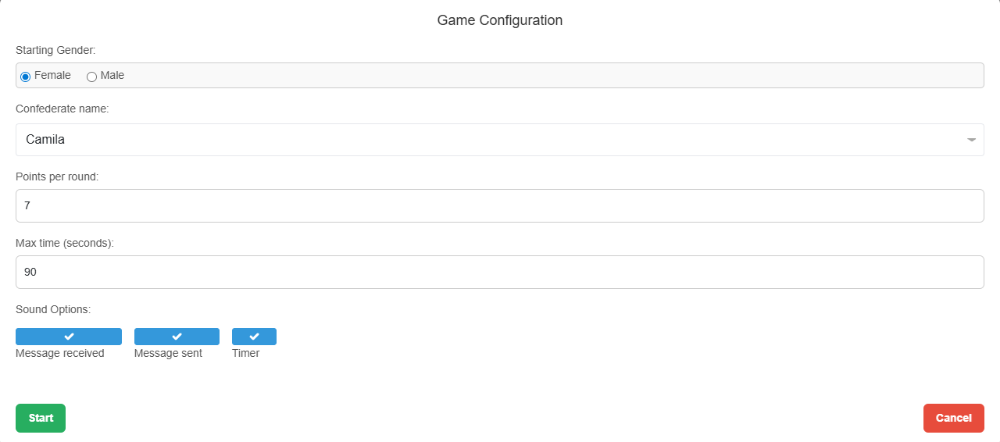
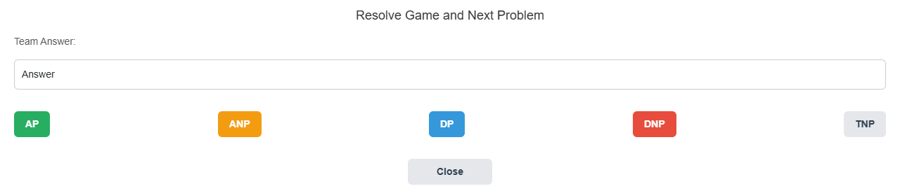

# Experiment Platform

A full-stack application for running behavioral experiments with real-time communication. Built with React and .NET 8.

## Screenshots

### Experimenter View

*The experimenter controls game flow, manages chat interactions, and monitors the session in real-time.*

### Participant View

*Participants solve problems collaboratively while chatting with a partner in real-time.*

### Game Configuration

*Experimenters configure session parameters: participant names, points per round, time limits, and audio cues.*

### Resolution Controls

*After each problem, the experimenter records the outcome (Correct, Incorrect, Timeout, etc.) for research analysis.*

## Project Structure

```
├── frontend/          # React application
├── backend/           # .NET 8 API with SignalR
├── CONTRIBUTING.md    # Contribution guidelines
└── README.md          # This file
```

## Quick Start

### Prerequisites

- [Node.js 18+](https://nodejs.org/) and npm
- [.NET 8 SDK](https://dotnet.microsoft.com/download/dotnet/8.0)

### One-Command Start (Windows)

```bash
start-dev.bat        # Full setup (runs npm install)
start-dev-fast.bat   # Fast mode (skips npm install)
```

This launches both backend and frontend in separate terminal windows.

### Manual Setup

#### Run Backend

```bash
cd backend
dotnet restore
dotnet run --project src/GameServer.Api
```

Backend runs at `http://localhost:5000`

#### Run Frontend

```bash
cd frontend
npm install
npm start
```

Frontend runs at `http://localhost:3000`

## Documentation

| Document | Description |
|----------|-------------|
| [Frontend README](./frontend/README.md) | React app setup, routes, and testing |
| [Backend README](./backend/README.md) | API endpoints, SignalR events, configuration |
| [Contributing Guidelines](./CONTRIBUTING.md) | Coding standards and PR process |
| [E2E Testing Guide](./frontend/E2E-TESTING.md) | Playwright end-to-end tests |
| [Minimal Theme Guide](./frontend/MINIMAL-THEME-GUIDE.md) | UI theme customization |

## Features

- **Real-time Communication** - SignalR for instant messaging and game state updates
- **Multi-language Support** - English and Portuguese via i18next
- **Role-based Views** - Separate interfaces for participants and experimenters
- **Game State Management** - Timer, scoring, and problem navigation
- **Research Telemetry** - CSV logging for data collection
- **Configurable Audio Cues** - Chimes for messages, timer events
- **E2E Testing** - Playwright tests for complete workflows

## Architecture

This platform is designed for **controlled research sessions** with exactly two connected users: one experimenter and one participant. This is intentional; behavioral research requires isolated, reproducible conditions where the experimenter has full control over the session environment.

The architecture reflects this constraint:

- **Singleton GameState** - A single shared game state ensures both users see identical, synchronized data
- **Centralized Timer** - Server-authoritative countdown prevents client-side manipulation
- **Real-time Event Bus** - SignalR broadcasts state changes to all connected clients immediately
- **Telemetry Pipeline** - Every interaction is logged to CSV for post-session analysis

```
┌─────────────────┐         SignalR          ┌─────────────────┐
│  Experimenter   │◄──────────────────────►  │   .NET 8 API    │
│   (React)       │                          │                 │
└─────────────────┘                          │  ┌───────────┐  │
                                             │  │ GameState │  │
┌─────────────────┐         SignalR          │  │(Singleton)│  │
│  Participant    │◄──────────────────────►  │  └───────────┘  │
│   (React)       │                          │                 │
└─────────────────┘                          └────────┬────────┘
                                                      │
                                                      ▼
                                             ┌─────────────────┐
                                             │  CSV Telemetry  │
                                             └─────────────────┘
```

For multi-session support, the architecture could be extended with session IDs and scoped state management, but the current design prioritizes simplicity and research validity over scalability.

## Security Considerations

> **⚠️ Important:** This application was not designed with security as a priority. It is intended for controlled research environments, not production deployment.

### Intended Use

This platform is designed to be:
- **Deployed on-demand** — only running during active data collection sessions
- **Hosted on a local network** — ideally accessible only to devices on the same LAN as the server

### Known Limitations

- No authentication or authorization mechanisms
- No input sanitization beyond basic framework defaults
- No rate limiting or abuse prevention
- No encryption of research data at rest

### Deployment Notes

University and institutional networks often have firewall restrictions that prevent local hosting. One workaround is using a reverse proxy service like [ngrok](https://ngrok.com/) to tunnel traffic to a home machine. This introduces additional risk since the application becomes publicly accessible, but may be acceptable for short data collection sessions (a few hours) where:

- The session URL is shared only with known participants
- The server is shut down immediately after the session
- No sensitive data beyond research responses is collected

**If you require a secure deployment**, consider adding authentication, HTTPS enforcement, and proper input validation before exposing this application to any untrusted network.

## Configuration

### Frontend Environment Variables

Create `frontend/.env.local`:

```env
REACT_APP_API_URL=http://localhost:5000/api
REACT_APP_HUB_URL=http://localhost:5000/api/gamehub
```

### Backend Configuration

Edit `backend/src/GameServer.Api/appsettings.json`:

```json
{
  "Game": {
    "MaxTime": 120,
    "PointsAwarded": 100,
    "LogPath": "logs"
  },
  "Cors": {
    "AllowedOrigins": ["http://localhost:3000"]
  }
}
```

## Testing

### Frontend Tests

```bash
cd frontend
npm test              # Watch mode
npm run test:ci       # Single run
npm run test:coverage # With coverage
```

### Backend Tests

```bash
cd backend
dotnet test
```

## Tech Stack

### Frontend
- React 18, React Router 6
- SignalR Client
- i18next
- Bootstrap 5
- Jest + React Testing Library

### Backend
- .NET 8, ASP.NET Core
- SignalR
- Clean Architecture
- xUnit, FluentAssertions, NSubstitute

## License

MIT
